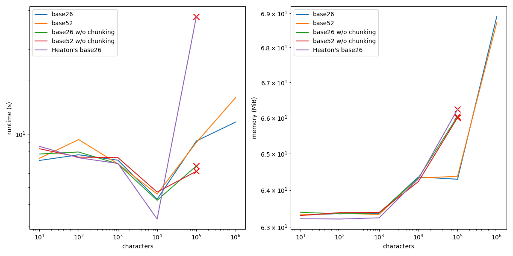

<div align="center">

# alphacodings


base26 ([A-Z]) and base52 ([A-Za-z]) encodings
</div>

## 🌟 overview

transform any string to alphabetic-only with base26 ([A-Z]) and base52 ([A-Za-z]) lossless encodings; useful for transmitting textual data over restrictive channels or for training AI models and tokenizers on simpler vocabularies.

**alphacodings** is a fast and lightweight library using [GMP arithmetic](https://gmplib.org).

## ⚙️ installation

```python
python -m pip install alphacodings
```

## 🚀 usage

```python
from alphacodings import base26_encode, base26_decode, base52_encode, base52_decode


string = """\
<!DOCTYPE html>
<html>
<head>
    <title>sample page</title>
</head>
<body>
    <h1>welcome!</h1>
    <p>you are reading a sample HTML string.</p>
</body>
</html>
"""


if __name__ == "__main__":
    encoding_base26 = base26_encode(string)
    print(encoding_base26)
    # >>> ["YBPNLKVNQWZQCMDHMLNDTVQCCRKQLNCFGMQPNGQCIXHUUPHFUNKUFEPDLKIGARFOKTDEZKQHXGCPYHDZKKVIUDNFOAYYAUOQFBJFFGSTKAXNWGDPVUJNBARPNXBASHZBXIBSSEFTAIQRPEADSOVVNXUMQXVDWTAIVCIVWQZAHAGYAVZYKGMETJOOUQNOEXMSOOGSKVMFBYZIBZDAITICYVXMJTTCCHPMSCABLYUMFDUNLVSLNKHSBPKCGASXJSFYDHZFAOEQTUACEBIFKQGYC"]

    encoding_base52 = base52_encode(string)
    print(encoding_base52)
    # >>> ["EgcgYRPxckylMQWRLDADNZxPJiJcHaVwYHLnicahBgaotGGANZuvsvcpSSOJFLXvKPjRlNQCJqqdviiIdtnwJyDOnWojsrpkWSTZFHbMIREvREjpsODtSxoLlLjQZOoehsGFzawGQecyuomgpZQNyFnZQLWPiDhzClwxBFCCwdqduGJoshrwFdwHWMtJpSTmjxzaYmNvzOIOwLkJvyQHCaFtrODPhbhBpPBmC"]

    assert base26_decode(encoding_base26) == string
    assert base52_decode(encoding_base52) == string
```

## 🧠 motivation

The library is inspired by [R. Heaton](https://github.com/robert)'s base26 implementation and his story of manipulating data transmission in restrictive network channels on long-distance flights using alphabetic-only encodings and tokenization.

have a look at the original [repository](https://github.com/robert/pyskywifi) and story [blog post](https://robertheaton.com/pyskywifi) and show him some love.

## 📊 benchmarking

our implementation is orders of magnitude more efficient on 100k+ strings:

<div align="center">


*Figure 1: runtime and memory usage performance against Heaton's original implementation with and without automatic chunking and SIMD on variable-length strings with a strict 60-second timeout; average over 5 trials.*
</div>

## 🤝 contributing

contributions to **alphacodings** are welcome!

feel free to submit pull requests or open issues on our repository.

## 📄 license

see the [LICENSE](LICENSE) file for more details.
